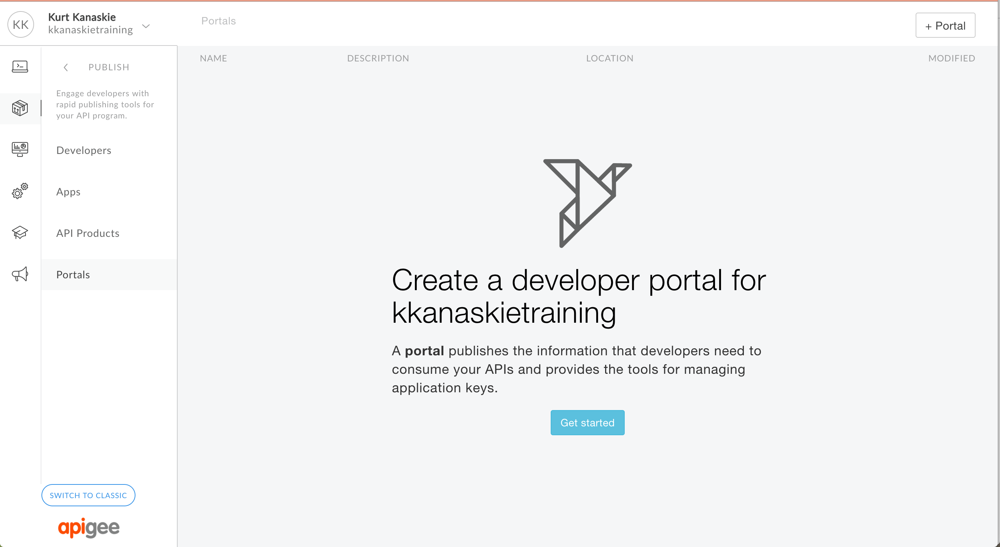
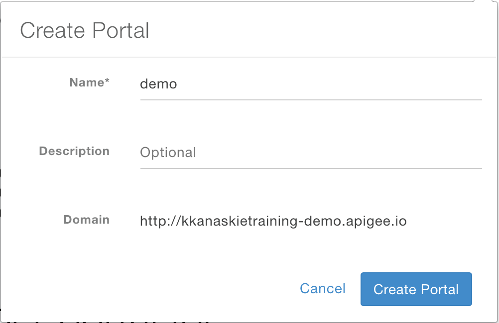
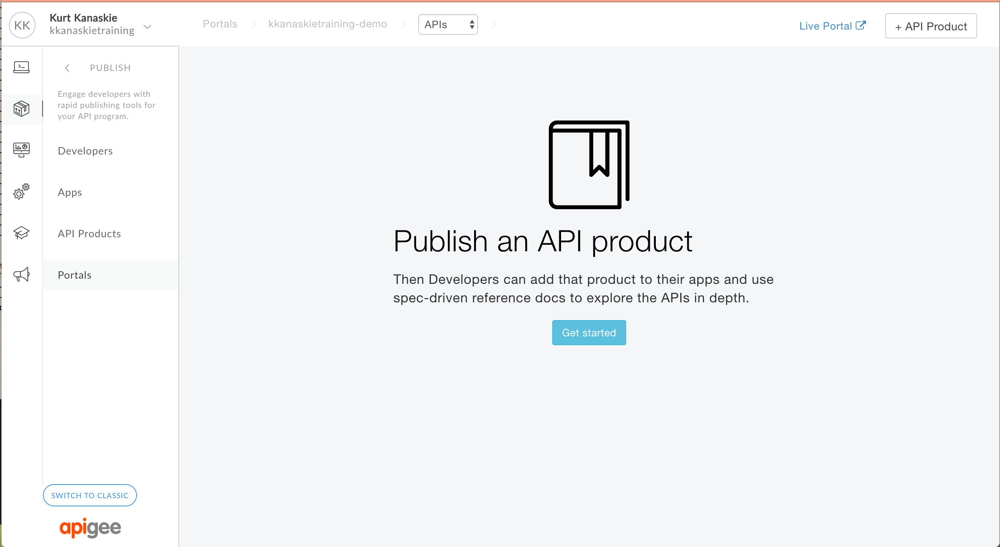
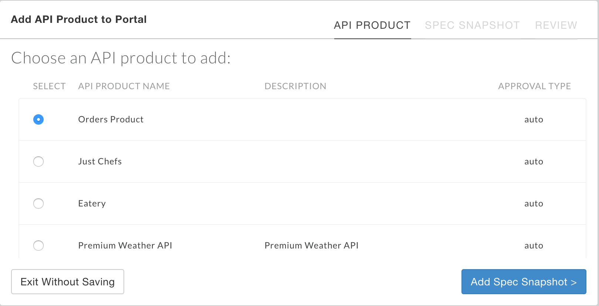
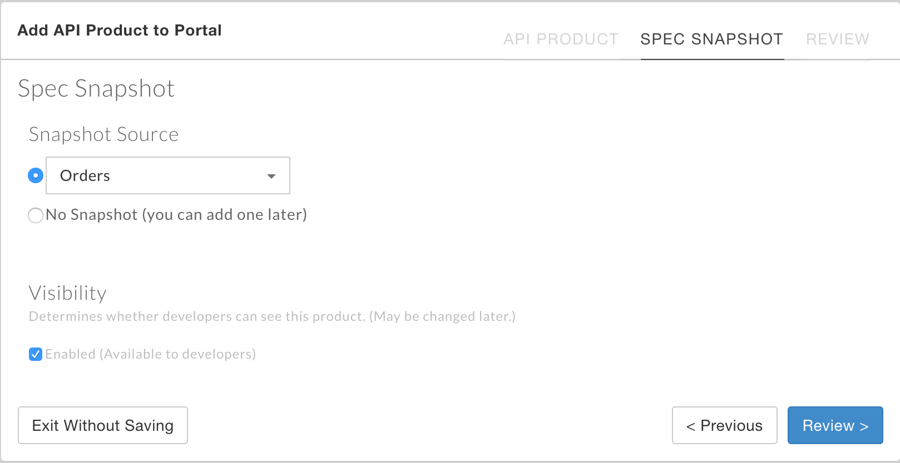
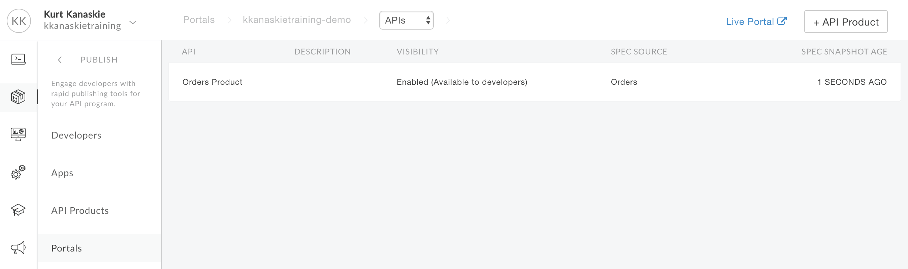
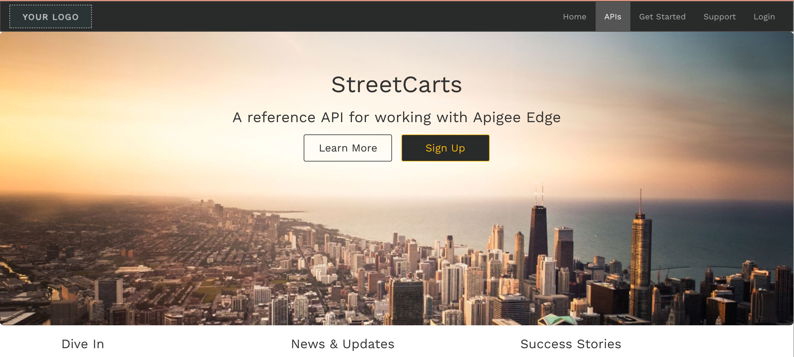
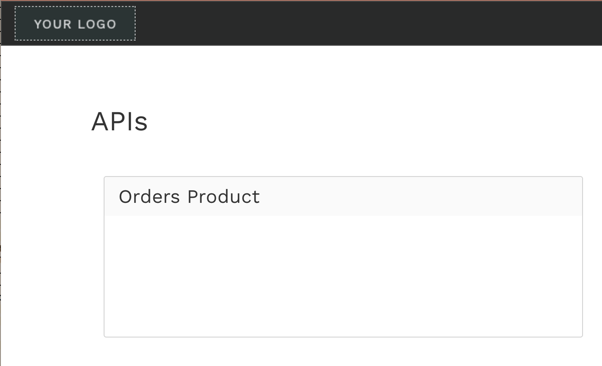
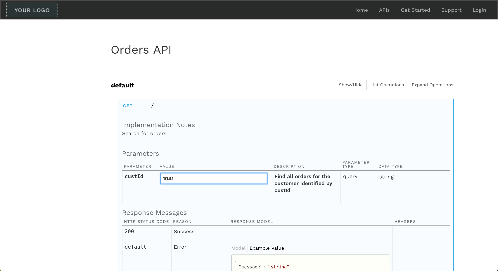

# Lab 1 - Publishing API Specification to Portal

In this lab, we'll publish our spec to the Portal. To begin, create a Portal from the *Publish* navigation menu...

 

and choose a name.

 

Next

 

Next

 

Next

 

Next

 

Next

 

Next

 

Next

 

# Congrats!

You have successfully completed this mini DevJam and scratched the surface of the capabilities of the platform. From here, you can check out the [product docs](http://docs.apigee.com/) or some of the [developer focussed videos](https://apigee.com/about/developers) that explain other features of the platform.

For more hands on examples, check out the [self-paced full DevJam workshop](https://github.com/apigee/devjam) or [self-paced hands on training](http://go.apigee.com/rg000Y1i0XRYDlWju00f0t0). 
